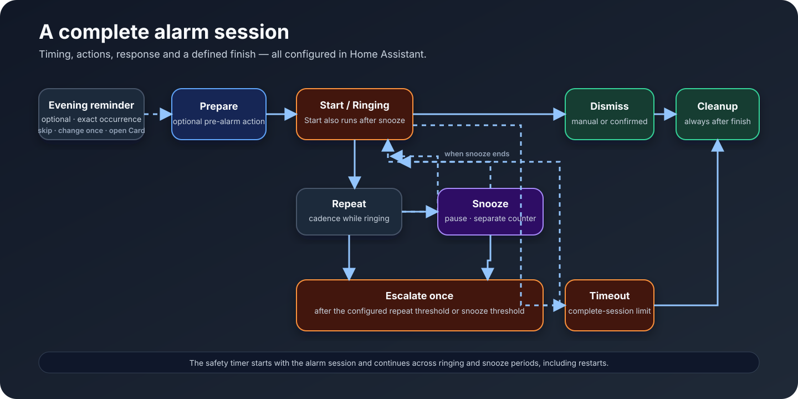
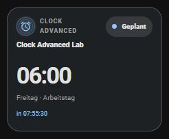
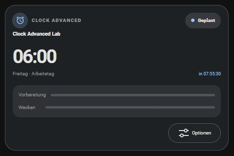
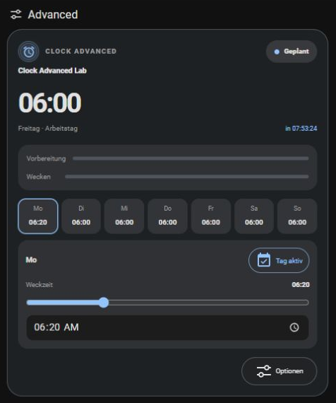
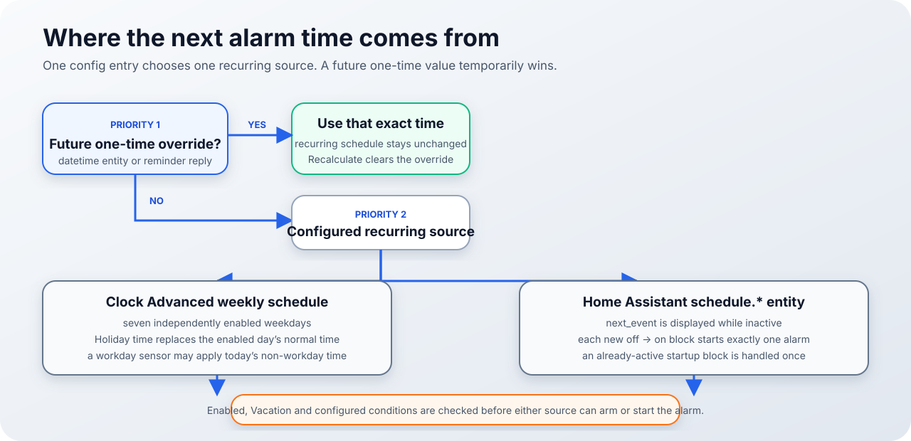

# Clock Advanced

[English](../../README.md) · **Deutsch**

<p align="center">
  <picture>
    <source media="(prefers-color-scheme: dark)" srcset="../images/clock-advanced-logo-dark.png">
    
  </picture>
</p>

<p align="center">
  <a href="https://github.com/MrCharly169/ClockAdvanced/actions/workflows/validate.yml"></a>
  <a href="https://github.com/MrCharly169/ClockAdvanced/releases"></a>
  <a href="https://github.com/MrCharly169/ClockAdvanced"></a>
  <a href="https://github.com/MrCharly169/ClockAdvanced/releases"></a>
  <a href="https://hacs.xyz/docs/faq/custom_repositories/"></a>
  <a href="#voraussetzungen"></a>
  <a href="../../LICENSE"></a>
</p>

**Ein vollständiger, über die Oberfläche konfigurierbarer Wecker für Home Assistant.** Clock Advanced vereint Zeitplan, Bedingungen, Aktionen, Schlummerverhalten, Eskalation und sicheren Abschluss eines Weckers in einer Integration. Eine responsive Dashboard-Card und ein kompaktes Badge sind enthalten.

> **Release-Kanal:** `2026.8.1b9` ist die aktuell veröffentlichte Beta-/Vorabversion. Der neueste stabile Release ist `2026.8.0`. Beta-Releases dienen zum Testen aktueller Funktionen; der stabile Release ist die passendere Wahl für die etablierte Basis.

## Mehr als eine Weckzeit

Eine Uhrzeit beantwortet nur das *Wann*. Zu einem verlässlichen Weckablauf gehört außerdem, was vorbereitet wird, ob der Wecker starten darf, wie oft eine Ausgabe wiederholt wird, was Schlummern bedeutet, wann eskaliert wird und wie alle Ausgaben beendet werden.

Clock Advanced bildet diesen vollständigen Vorgang ab. Ein Config Entry entspricht einem unabhängigen Wecker mit eigenem Zeitplan, eigenen Bedingungen, Aktionsfolgen, Zustand und Bedienelementen. Planung, Bedingungen und Aktionen werden über die Home-Assistant-Oberfläche konfiguriert. So entsteht ein nachvollziehbarer Lebenszyklus statt einer einzelnen zeitgesteuerten Automation.



## Für wen Clock Advanced gedacht ist

Clock Advanced eignet sich, wenn du:

- verschiedene Räume oder Personen mit unabhängigen Weckern ausstatten möchtest;
- Licht, Media Player, Rollläden, Skripte oder Benachrichtigungen in einem UI-verwalteten Ablauf kombinieren willst;
- einen einfachen Wochenplan oder eine vorhandene Home-Assistant-Entität `schedule.*` verwenden möchtest;
- während persönlicher Ferien später geweckt werden, im Urlaub aber vollständig blockieren möchtest;
- eine Ausgabe wiederholen willst, ohne jede Wiederholung als Schlummern zu zählen;
- nach einer gewählten Zahl von Wiederholungen oder abgelaufenen Schlummerpausen einmalig eskalieren möchtest;
- Medien und Licht nach Beenden oder Sicherheitsabschaltung definiert ausschalten willst.

## Was Clock Advanced tut — und was nicht

| Clock Advanced tut | Clock Advanced tut nicht |
| --- | --- |
| Erstellt pro Config Entry ein Home-Assistant-Gerät mit standardisierten Entitäten | Ist nur eine Dashboard-Uhr oder ein einzelner Helper |
| Berechnet oder beobachtet Weckzeiten und führt konfigurierte Home-Assistant-Aktionsfolgen aus | Liefert von sich aus Weckton, Licht oder Geräteverhalten |
| Behandelt Wiederholen, Schlummern und Eskalieren als getrennte Konzepte | Macht aus jeder Wiederholung automatisch Schlummern oder Eskalation |
| Liefert Card, Badge, grafische Editoren und einen öffentlichen Statusvertrag | Benötigt die Card für Planung oder Laufzeit |
| Speichert und rekonstruiert den aktiven Vorgang innerhalb von Home Assistant | Fügt keinen separaten Cloud-Zeitplaner und kein Konto hinzu |

Die in einer Aktion verwendeten Geräte und Dienste bleiben unter deiner Kontrolle. Eine Media-Aktion kann zum Beispiel weiterhin eine Cloud-Integration ansprechen, wenn du genau das konfigurierst.

## Screenshots

Diese Screenshots stammen von der echten gebündelten Card und dem Badge in der neutralen Home-Assistant-2026.8.1-Testinstanz.

| Kompakt | Einfach |
| --- | --- |
|  |  |
| **Erweitert mit Wochenplan** | **Clock-Advanced-Badge** |
|  |  |

Kompakt zeigt nur den unmittelbar relevanten Alarmkontext. Einfach ergänzt den Lebenszyklus und außergewöhnliche Optionen. Erweitert fügt die direkte Wochenbearbeitung und technische Bedingungsdetails hinzu. Die Card folgt dem Home-Assistant-Theme; die Abbildungen zeigen die geprüfte dunkle Darstellung.

## Schnellstart

### Voraussetzungen

- Home Assistant **2026.8.0 oder neuer**
- ein von Home Assistant verwaltetes Dashboard, wenn du den grafischen Card- oder Badge-Editor nutzen möchtest
- HACS nur bei Installation über HACS

### Über HACS als Custom Repository installieren

1. Öffne **HACS → Integrationen**.
2. Öffne das HACS-Menü und wähle **Benutzerdefinierte Repositories**.
3. Füge `https://github.com/MrCharly169/ClockAdvanced` mit der Kategorie **Integration** hinzu.
4. Wähle **Clock Advanced**, den gewünschten Release-Kanal und lade ihn herunter.
5. Starte Home Assistant neu.

Der Release-Workflow veröffentlicht genau ein HACS-kompatibles Asset namens `clock_advanced.zip`. Das GitHub-Badge „Release downloads“ zählt Downloads veröffentlichter GitHub-Release-Assets; es ist keine Zahl für Installationen, aktive Nutzer oder HACS-Downloads.

### Manuell installieren

1. Lade `clock_advanced.zip` aus dem gewünschten [GitHub-Release](https://github.com/MrCharly169/ClockAdvanced/releases) herunter.
2. Entpacke den enthaltenen Ordner `custom_components/clock_advanced` nach `<config>/custom_components/clock_advanced`.
3. Starte Home Assistant neu.

Benenne den Integrationsordner nicht um und verschiebe die gebündelten Frontend-Dateien nicht.

### Einen Wecker anlegen

1. Öffne **Einstellungen → Geräte & Dienste → Integrationen**.
2. Wähle **Integration hinzufügen** und suche nach **Clock Advanced**.
3. Schließe den Einrichtungsassistenten ab. Jeder abgeschlossene Ablauf erzeugt einen unabhängigen Wecker.

### Dashboard-Ressource registrieren

Registriere diese URL einmal unter **Einstellungen → Dashboards → Ressourcen** als **JavaScript-Modul**:

```text
/clock_advanced/clock-advanced-card.js
```

Die URL ist absichtlich dauerhaft und enthält keinen Versionsparameter. Das Integrationsmanifest ist die einzige technische Versionsquelle. Führe nach einem Update einen Hard Refresh aus, falls der Browser noch eine ältere Card ausliefert.

### Card und Badge hinzufügen

Wähle in von Home Assistant verwalteten Dashboards **Dashboard bearbeiten → Karte hinzufügen → Clock Advanced** beziehungsweise **Badge hinzufügen → Clock Advanced**. YAML-Dashboards können dieselben Definitionen verwenden, bieten aber nicht den grafischen Home-Assistant-Editor.

Minimale Easy-Card:

```yaml
type: custom:clock-advanced-card
entity: sensor.advanced_alarm_clock_status
mode: easy
language: auto
```

Minimales Badge:

```yaml
type: custom:clock-advanced-badge
entity: sensor.advanced_alarm_clock_status
language: auto
```

Verwende den tatsächlichen Statussensor deines Config Entry. Die einmalige Einrichtungsbenachrichtigung enthält beide kopierfertigen Definitionen mit der richtigen Entity-ID.

## Der Einrichtungsassistent

Der Assistent folgt dem Kundenablauf in zehn kleinen Entscheidungen:

1. **Name** — Raum oder Zweck, der auf Gerät, Card und Benachrichtigungen erscheint.
2. **Weckzeit-Quelle** — interner Wochenplan oder vorhandene Home-Assistant-Zeitplan-Entität.
3. **Zeitplan** — sieben Wochentage und alternative Zeiten oder die gewählte `schedule.*`-Entität.
4. **Bedingungen und Sperren** — Arbeitstag, Urlaub, Aufstehbestätigung und native Home-Assistant-Bedingungen.
5. **Vor dem Wecker und beim Start** — optionale Prepare- und Start-Aktionen.
6. **Schlummern und keine Reaktion** — Rhythmus, Schlummern, Eskalation, Zeitlimit und Aktionen.
7. **Vorabend-Erinnerung** — optionale Erinnerung für den exakten Termin und Card-Pfad.
8. **Benachrichtigungen** — Empfänger und ausgewählte Lebenszyklusmeldungen.
9. **Abschluss und Sicherheit** — Dismiss-, Timeout- und Cleanup-Aktionen.
10. **Prüfen** — Zusammenfassung und ausdrückliche Bestätigung.

Jeder Bereich bleibt später unter **Einstellungen → Geräte & Dienste → Clock Advanced → Konfigurieren** bearbeitbar. Beim Speichern wird nur dieser Config Entry neu geladen. Wochentagsänderungen in der Advanced Card verwenden den eigenen Integrationsdienst und berechnen neu, ohne den Entry neu zu laden.

## Weckzeit-Quellen und exakte Priorität



Clock Advanced bestimmt den nächsten Termin in dieser Reihenfolge:

1. Eine **zukünftige einmalige Abweichung** in der erzeugten `datetime`-Entität hat Vorrang.
2. Andernfalls gilt die für den Entry konfigurierte wiederkehrende Quelle:
   - der **Clock-Advanced-Wochenplan** oder
   - eine vorhandene **Home-Assistant-Entität `schedule.*`**.

Die beiden wiederkehrenden Quellen sind Alternativen und keine aufeinander gestapelten Prioritäten. Bei einer Zeitplan-Entität wird im inaktiven Zustand `next_event` angezeigt; jeder echte Wechsel von `off` nach `on` startet genau einen Wecker. Ein beim Start von Clock Advanced bereits aktiver Block wird einmal behandelt. Solange eine zukünftige einmalige Abweichung wartet, löst ein Schedule-Block keinen zusätzlichen Wecker aus.

Die Schaltfläche **Abweichung löschen und neu berechnen** entfernt die einmalige Abweichung, löscht „Nächsten auslassen“ und einen gespeicherten übersprungenen Termin und kehrt dann zur wiederkehrenden Quelle zurück.

## Wochenplan, Ferienzeit und Urlaub

Der interne Wochenplan speichert für jeden Wochentag ein Aktiv-Flag und eine Uhrzeit. Deaktivierte Tage bleiben auch bei aktiver Ferienzeit deaktiviert.

- **Ferienzeit** lässt den Wecker aktiv und ersetzt normale Uhrzeiten durch zwei konfigurierbare Alternativen: eine für Montag–Freitag und eine für Wochenende/Feiertage. Deaktivierte Tage bleiben deaktiviert.
- Ein optionaler **Arbeitstag-Sensor** kann bei `off` für heute die Nicht-Arbeitstag-Zeit anwenden. Alternativ kannst du Nicht-Arbeitstage vollständig blockieren.
- **Urlaub** ist eine Sperre. Der integrationseigene Urlaubsschalter oder eine ausdrücklich gewählte externe Urlaubs-Entität verhindert Vorbereitung und Start. Wird Urlaub während eines aktiven Vorgangs eingeschaltet, beendet Clock Advanced ihn über den normalen Abschlussweg.

Ferienzeit verändert, *wann* ein aktivierter wöchentlicher Termin stattfindet. Urlaub legt fest, dass kein Termin stattfinden darf.

## Card-Modi

- **Kompakt** — Uhrzeit, Zustand und aktiver Alarmkontext im kleinsten Layout. Zeitplan und Optionsmenü sind ausgeblendet.
- **Einfach** — empfohlene Alltagsansicht mit nächstem Alarmkontext, Schlummern/Beenden im aktiven Zustand und geschlossenem Options-Overlay für „Nächsten auslassen“, Ferienzeit und Urlaub.
- **Erweitert** — Einfach plus Sieben-Tage-Plan, Fünf-Minuten-Schieberegler, exaktes Zeitfeld, Tagesaktivierung sowie technische Bedingungs- und Sicherheitsdetails in Optionen. Der ausgewählte Tag ist gelb markiert; der Editor folgt seiner wirksamen normalen Uhrzeit oder Ferienzeit.

`easy` ist Standard. Alte Werte `auto` und `standard` erscheinen als Einfach; `kiosk` erscheint als Erweitert. `language` akzeptiert `auto`, `en` oder `de`. Die Card folgt Themes, respektiert reduzierte Bewegung, unterstützt Sections-Grid-Größen und verwendet stabile DOM-Knoten, damit Countdown-Aktualisierungen Bedienelemente nicht absichtlich ersetzen oder Scrollen anfordern.

## Clock-Advanced-Badge

Das gebündelte Badge verwendet die kleine native `ha-badge`-Geometrie von Home Assistant. Das Weckersymbol bleibt immer sichtbar; eine kleinere Markierung und eine semantische Theme-Farbe zeigen den aktuellen Lebenszykluszustand. Tooltip und Barrierefreiheitsname enthalten Zustand und passenden Zeitkontext. Maus, Enter oder Leertaste öffnen den normalen Mehr-Info-Dialog des Statussensors.

## Weck-Lebenszyklus

Acht optionale Aktionsfolgen verwenden den nativen Home-Assistant-Aktionseditor. Jede Folge erhält eine Variable `clock_advanced` mit den öffentlichen Ereignisdaten.

| Phase | Ausführungszeitpunkt |
| --- | --- |
| `prepare` | Zum konfigurierten Vorlauf; ein Vorlauf von `0` deaktiviert diese Phase |
| `start` | Beim ersten Weckstart und erneut nach jeder abgelaufenen Schlummerpause |
| `repeat` | Im konfigurierten Rhythmus, solange der Zustand `ringing` bleibt |
| `snooze` | Sofort beim Drücken von Schlummern |
| `escalate` | Einmal pro Vorgang nach dem Wiederholungs- oder Schlummer-Grenzwert |
| `dismiss` | Wenn ein aktiver Vorgang manuell, durch Bestätigung, Deaktivierung oder Sperre beendet wird |
| `timeout` | Wenn das Zeitlimit des gesamten Vorgangs erreicht wird |
| `cleanup` | Nach Dismiss oder Timeout als letzte gemeinsame Aktionsfolge |

Die Integration sendet außerdem das versionierte Ereignis `clock_advanced_phase` für diese Phasen sowie für `skipped` und `error`. Die öffentlichen Daten enthalten Vertragsversion, Config-Entry-ID, Weckername, Zustand, Phase, nächsten Wecker, Wiederholungs-/Schlummerzähler und Eskalationsstatus. Konfigurierte Aktionsinhalte sind nicht enthalten.

### Wiederholen, Schlummern und Eskalieren sind verschieden

- **Wiederholen** stößt die eigene Aktion während des Klingelns im eingestellten Rhythmus erneut an und erhöht nur `repeat_count`.
- **Schlummern** pausiert den klingelnden Vorgang, setzt den Wiederholungszähler zurück, erhöht nur `snooze_count` und führt nach Ende der Pause Start erneut aus.
- **Eskalieren** läuft höchstens einmal pro Vorgang. Auslöser kann der Wiederholungsgrenzwert oder die konfigurierte Zahl abgelaufener Schlummerpausen sein.

### Öffentliche Zustände

Der Statussensor stellt exakt diese Zustände bereit:

| Zustand | Bedeutung |
| --- | --- |
| `idle` | Zurzeit ist kein nächster Wecker verfügbar |
| `scheduled` | Ein nächster Termin ist geplant oder wird angezeigt |
| `disabled` | Der Aktiviert-Schalter des Entry ist aus |
| `vacation` | Integrationseigener oder externer Urlaub ist aktiv |
| `blocked` | Eine andere konfigurierte Bedingung verhindert die Planung |
| `pre_alarm` | Prepare hat vor dem Termin begonnen |
| `ringing` | Der Weckvorgang klingelt aktiv |
| `snoozed` | Der Vorgang wartet auf das Ende der Schlummerpause |
| `dismissed` | Der aktive Vorgang wurde beendet oder bestätigt |
| `skipped` | Der ausgewählte Termin wurde ausgelassen |
| `timeout` | Die Sicherheitsabschaltung hat den Vorgang beendet |
| `error` | Eine Aktion ist fehlgeschlagen oder der gespeicherte aktive Zustand war ungültig |

`pre_alarm`, `ringing` und `snoozed` sind aktive Zustände. Beendet, Übersprungen, Zeitüberschreitung und Fehler bleiben für die konfigurierte Endstatusdauer sichtbar, bevor der Zeitplan neu berechnet wird.

## Bedingungen und sichere Abschaltung

Bedingungen werden vor Prepare und erneut vor Start geprüft. Alle nativen Home-Assistant-Startbedingungen müssen erfüllt sein. Die Oberfläche unterstützt die vom Home-Assistant-Bedingungsselektor bereitgestellten Typen, darunter Zustand, numerischer Zustand, Zeit, Zone, Gerät, Template und verschachtelte UND-/ODER-/NICHT-Strukturen.

Weitere Bedienelemente sind:

- der Aktiviert-Schalter des Entry;
- ein optionaler Arbeitstag-Sensor und eine optionale vollständige Nicht-Arbeitstag-Sperre;
- integrationseigener oder externer Urlaub;
- ein Binärsensor zur Aufstehbestätigung;
- „Nächsten auslassen“;
- Grenzen für Schlummern und Eskalation;
- die Sicherheitsabschaltung für den gesamten Vorgang.

Wird eine konfigurierte Sperre während `pre_alarm`, `ringing` oder `snoozed` aktiv, beendet Clock Advanced den Vorgang und führt danach Cleanup aus. Auch ein eingeschalteter Bestätigungssensor beendet ihn. Das Sicherheitszeitlimit startet mit dem Weckvorgang, umfasst alle Schlummerpausen, bleibt bei Wiederherstellung erhalten und endet mit Timeout gefolgt von Cleanup.

Cleanup ist ein definierter Abschluss-Hook und keine Garantie, dass jeder konfigurierte Gerätebefehl erfolgreich ist. Aktionsfehler werden protokolliert, als Fehlerphase veröffentlicht und ersetzen den berechneten wiederkehrenden Zeitplan nicht.

## Benachrichtigungen und einmalige Änderungen

Lebenszyklusmeldungen und Vorabend-Erinnerung sind getrennte Optionen.

Aktiviere für Lebenszyklusmeldungen den Hauptschalter und wähle aus Prepare, Start, Repeat, Escalate, Snooze, Dismiss, Timeout, Skipped, Blocked und Error. Als Empfänger sind eine oder mehrere `notify.*`-Entitäten möglich. Ohne Empfänger erstellt Clock Advanced stattdessen eine persistente Home-Assistant-Benachrichtigung. Die ausgelieferte Standardauswahl ist Start, Eskalation, Timeout und Blockiert, sobald Lebenszyklusmeldungen aktiviert sind.

Die optionale Vorabend-Erinnerung nennt zur konfigurierten Uhrzeit den exakten Termin für morgen und verwendet dieselbe Empfängerliste. Native mobile Notify-Empfänger erhalten Aktionen, um:

- genau diesen Termin auszulassen;
- nur seine Uhrzeit mit einer Antwort `HH:MM` zu ersetzen;
- den konfigurierten Pfad zur Clock Card zu öffnen.

Der Zeitstempel des Termins gehört zum Aktionstoken. Eine Aktion aus einer älteren Meldung kann daher keinen neueren Wecker verändern. Eine einmalige Änderung lässt den Wochenplan unverändert. Ohne ausgewählten Empfänger erscheint die Erinnerung mit Clock-Link im Home-Assistant-Benachrichtigungseingang.

## Update und Deinstallation

### Update

1. Lies den [Changelog](../../CHANGELOG.md), insbesondere Beta-Hinweise und Migrationsauswirkungen.
2. Installiere den gewünschten Release über HACS oder ersetze bei manueller Installation `custom_components/clock_advanced` mit dem passenden Release-Asset.
3. Starte Home Assistant neu.
4. Führe einen Hard Refresh aus, falls die dauerhafte Card-Ressource noch aus dem Browser-Cache kommt.

Notwendige Config-Entry-Migrationen laufen automatisch; bearbeite gespeicherte Home-Assistant-Config-Entry-Daten nicht von Hand.

### Deinstallation

1. Entferne jeden Clock-Advanced-Entry unter **Einstellungen → Geräte & Dienste**.
2. Entferne die zugehörigen Card- und Badge-Definitionen aus den Dashboards.
3. Entferne die gemeinsame Dashboard-Ressource, sobald kein Clock-Advanced-Entry mehr vorhanden ist.
4. Deinstalliere das HACS-Repository oder lösche bei manueller Installation `<config>/custom_components/clock_advanced`.
5. Starte Home Assistant neu.

Mit dem Entry verschwinden seine Entitäten aus der aktiven Nutzung. Exportiere Zeitplan und Aktionskonfiguration, wenn du sie vor dem Entfernen behalten möchtest.

## Datenschutz und lokale Verarbeitung

Clock Advanced ist als berechnende Home-Assistant-Integration deklariert und besitzt weder Python-Paketabhängigkeiten noch einen Clock-Advanced-Cloud-Dienst. Planung, persistierter Laufzeitzustand, Bedingungsprüfung und Aktionsauslösung geschehen innerhalb deiner Home-Assistant-Instanz.

Eigene Aktionen und gewählte Notify-Entitäten können entsprechend den jeweiligen Home-Assistant-Integrationen mit externen Diensten kommunizieren. Clock Advanced macht solche Integrationen nicht lokal.

Heruntergeladene Diagnosen schwärzen konfigurierte Aktionsfolgen, native Bedingungen, Benachrichtigungsziele sowie verknüpfte Arbeitstag-, Urlaubs-, Bestätigungs- und alte Freigabe-/Sperr-Entitäten. Diagnosen enthalten weiterhin Betriebszustand, Zeiten und den öffentlichen Wochenplan. Prüfe jede Diagnosedatei vor dem Teilen.

## FAQ

### Ist Clock Advanced ein Helper?

Nein. Clock Advanced ist eine normale Integration unter **Geräte & Dienste**. Eine vorhandene Home-Assistant-Zeitplanhilfe kann als Quelle dienen; Clock Advanced wird dadurch nicht selbst zu diesem Helper.

### Brauche ich pro Raum oder Person einen Config Entry?

Ja. Ein Config Entry besitzt genau ein Weckergerät und einen Lebenszyklus. Lege für einen unabhängig geplanten Wecker einen weiteren Entry an.

### Müssen Aktionen konfiguriert sein?

Nein. Alle acht Aktionsfolgen sind optional. Mit leeren Folgen bleiben Zeitplan, Zustand, Card und Bedienelemente verfügbar.

### Wo bearbeite ich eine externe Schedule-Quelle?

In der nativen Home-Assistant-Zeitplanoberfläche. Clock Advanced zeigt `next_event` und reagiert auf neue aktive Blöcke; die Advanced Card bearbeitet diesen externen Zeitplan nicht.

### Warum ist Schlummern nicht verfügbar?

Schlummern ist nur im Zustand `ringing` verfügbar, wenn die maximale Zahl größer als null und noch nicht erreicht ist.

### Läuft Cleanup nach „Nächsten auslassen“?

Nein. Ein ausgelassener Termin wird nie zu einem aktiven Vorgang. Cleanup folgt auf Dismiss oder Timeout. Eine Sperre, Urlaub oder das Deaktivieren während eines aktiven Vorgangs verwendet den Dismiss-Weg und erreicht deshalb Cleanup.

### Wie entferne ich einen einmaligen Wecker?

Drücke **Abweichung löschen und neu berechnen**. Damit kehrt der Wecker zur wiederkehrenden Quelle zurück; zugleich werden „Nächsten auslassen“ und der gespeicherte übersprungene Termin gelöscht.

## Fehlerbehebung und Support

### Die Card meldet, dass der Wecker nicht verfügbar ist

- Prüfe, ob `/clock_advanced/clock-advanced-card.js` genau einmal als JavaScript-Modul registriert ist.
- Prüfe, ob die Card auf den Enum-Statussensor dieses Entry verweist.
- Führe nach einem Update einen Hard Refresh aus.
- Prüfe Browserkonsole und Home-Assistant-Protokoll auf Ressourcenfehler.

### Es ist kein Wecker geplant

- Prüfe Aktiviert, Urlaub, „Nächsten auslassen“ und alle Bedingungen.
- Prüfe beim Wochenplan, ob mindestens ein zukünftiger Wochentag aktiviert ist.
- Prüfe bei einer Schedule-Quelle `next_event` und warte auf einen echten Wechsel von `off` nach `on`.
- Prüfe, ob absichtlich eine zukünftige einmalige Abweichung Vorrang hat.

### Ein Wecker startete nicht oder wurde sofort beendet

- Prüfe die Attribute `last_reason` und `last_error` des Statussensors.
- Prüfe Arbeitstag, Urlaub, Aufstehbestätigung und jede native Startbedingung.
- Beachte, dass eine während des Vorgangs aktive Sperre ihn absichtlich beendet.

Verwende für reproduzierbare Fehler das [Bug-Formular](https://github.com/MrCharly169/ClockAdvanced/issues/new?template=bug_report.yml) und für Ideen das [Feature-Formular](https://github.com/MrCharly169/ClockAdvanced/issues/new?template=feature_request.yml). Füge keine Zugangsdaten, privaten Benachrichtigungsziele oder sensiblen Diagnosen ein. Sicherheitsmeldungen gehören in [SECURITY.md](../../SECURITY.md). Hinweise für Beiträge stehen in [CONTRIBUTING.md](../../CONTRIBUTING.md).

## Open Source, Lizenz und Unterstützung

Clock Advanced ist Open Source unter der [MIT-Lizenz](../../LICENSE). Private und kommerzielle Nutzung sind nach Maßgabe der Lizenz erlaubt, einschließlich ihrer Vorgaben zu Copyright-/Erlaubnisvermerk und Haftungsausschluss. Es gibt keine separate kommerzielle Lizenz und keine Lizenzgebühr.

Das Testen von Beta-Releases, reproduzierbare Fehlerberichte, Kompatibilitätsverbesserungen, Übersetzungen und Dokumentationsarbeit sind wertvolle freiwillige Unterstützung. Sie ermöglichen Weiterentwicklung, Tests, Kompatibilitätsarbeit und Dokumentation. In diesem Repository ist derzeit keine verifizierte Buy-Me-a-Coffee- oder Sponsor-URL vorhanden; deshalb enthält die Seite bewusst kein Spenden-Badge und keinen erfundenen Link.

## Migration

Lege beim Ersatz einer vorhandenen Weckautomation zunächst einen Clock-Advanced-Entry mit leeren physischen Ausgabeaktionen an. Prüfe Zeitplan, Ferienzeit, Urlaub, Bedingungen, Schlummern und Timeout. Übertrage danach die Aktionen Phase für Phase. Deaktiviere die alte Automation erst nach einem vollständigen erfolgreichen Testzyklus.

Siehe [Migrationsanleitung](../MIGRATION.md), das neutrale [Beispiel für Anwesenheit, Musik und Schlummern](../../examples/occupancy_music_snooze.yaml) und das ausführliche [HAUS1-ET1-Migrationsprofil](../../examples/haus1_et1_migration.yaml). Das Beispielprofil enthält migrationsspezifische Entity-IDs; in der Integration sind sie nicht fest eingebaut.

## Entwicklerdetails

Kompatibilitäts- und Verhaltensvertrag stehen in [BASELINE.md](../BASELINE.md) und [REGRESSION_MATRIX.md](../REGRESSION_MATRIX.md). Die lokale Testumgebung ist in [DEVELOPMENT.md](../DEVELOPMENT.md) beschrieben.

Repository-Prüfungen im Projektstamm:

```powershell
python -m unittest discover -s tests -v
python scripts/check_source_syntax.py
node tests/test_card_runtime.js
python scripts/build_release.py --check
```

Das kanonische Frontend ist `custom_components/clock_advanced/frontend/clock-advanced-card.js`, die dauerhafte Ressource `/clock_advanced/clock-advanced-card.js`, und `custom_components/clock_advanced/manifest.json` bleibt die einzige technische Versionsquelle.
